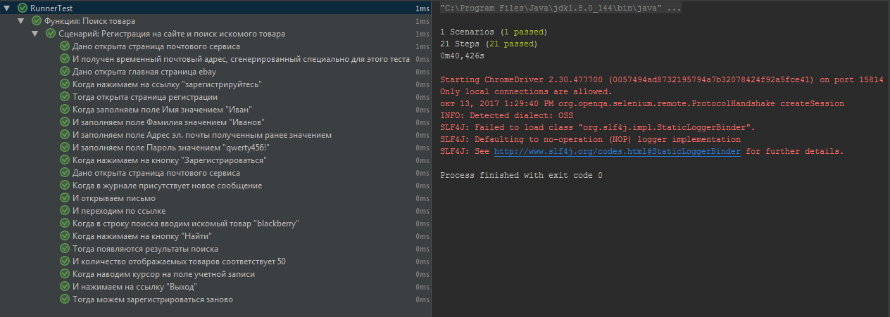

# Тест регистрации и поиска на сайте https://www.ebay.com/

### Задание
1.    Перейдите на сайт https://www.ebay.com/
2.    Кликните на ссылку «Зарегистрируйтесь»
3.    В форме регистрации заполните все поля корректными данными
4.    Нажмите кнопку «Зарегистрироваться»
5.    Перейдите в почтовый ящик, на который было отправлено письмо с подтверждением
6.    Проверьте , что письмо действительно является актуальным
7.    Перейдите по ссылке из письма для активации учетной записи
8.    Активируйте учетную запись
9.    Войдите в кабинет под своей учетной записью
10.   Перейдите на главную страницу сервиса
11.   Выполните поиск по товарам «blackberry»
12.   Проверьте, что на странице отображается 50 товаров
13.   Выйдите из под своей учетной записи
14.   Проверьте, что вы успешно вышли из под учетной записи

### Детали реализации
Задание выполнялось с использованием
- **Java 1.8**
- **Cucumber 1.2.5**
- **SeleniumWB 3.4.0**
- **jUnit 4.12**
- **Allure 1.6.1**
- **Jetty 9.2.10.v20150310**

### Запуск проекта
В командной строке перейти в папку проекта и выполнить: mvn clean test site jetty:run

После выполнения тестов доступен отчет по адресу "localhost:8080"

### Результаты выполнения задания
